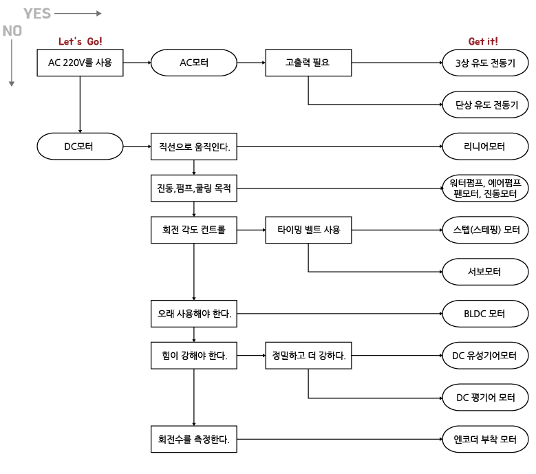

# Robot Automation Raspberry Pi

## Concept

Build a Smart-Farm Automation System with Raspberry Pi

## Mission

* Auto hydration system by humidity sensors
* Flip buckets

## Questions

* How to choose motors?
  * Torks
  * RPM
  * Amperes
  * Volts
  * Watts

* What types of motor can be controlled by RPi?
  * DC
    * Servo
    * Step
  * AC

* How to be waterproof?

## Motor Lists

* https://korean.alibaba.com/product-detail/t-motor-customized-dc-big-thrust-motor-kv80-kv100-for-100kg-payload-drone-match-40-inch-prop-60818072557.html
* https://motorbank.co.kr/
